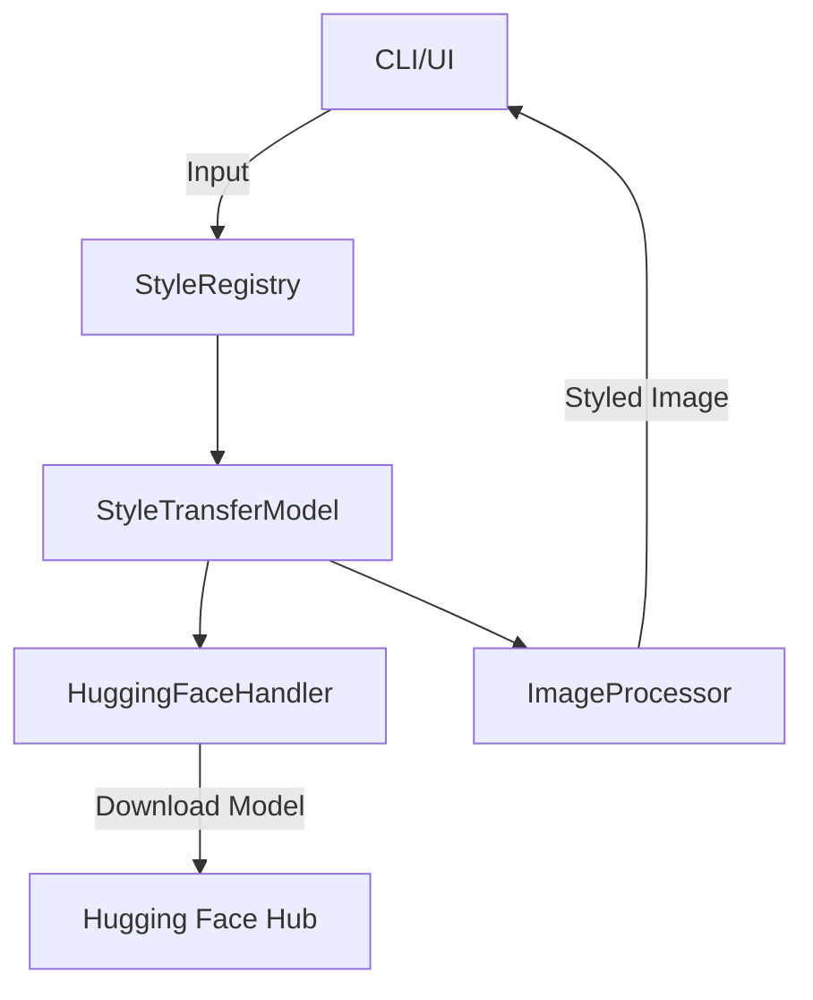

# Architecture of Artify

Artify's architecture is modular and well-structured, comprising the following components:

## Core Modules
1. **CLIHandler**:
   - Provides a command-line interface for advanced users.
   - Handles input validation, logging, and calling other components.
   
2. **UIHandler**:
   - Interactive interface built with Streamlit.
   - Supports image uploads, style selection, and real-time results.

3. **Core Modules**:
   - **StyleTransferModel**:
     - Core logic for style transfer using PyTorch and VGG-19.
     - Loads pre-trained models dynamically from Hugging Face.
   - **ImageProcessor**:
     - Handles image pre-processing (resizing, normalization).
     - Converts tensors back to PIL images.
   - **HuggingFaceHandler**:
     - Manages model downloads from Hugging Face.
     - Integrates cache management for efficiency.

4. **Utilities**:
   - **Logger**:
     - Centralized logging for CLI, UI, and internal modules.
   - **StyleRegistry**:
     - Manages available artistic styles and random style image retrieval.

## Architecture Diagram

## High-Level Flow
1. **Input Handling**:
   - CLI arguments or UI input are parsed and validated.
2. **Model Management**:
   - The appropriate model is ensured (downloaded or cached).
3. **Style Transfer**:
   - Content and style features are extracted using VGG-19.
   - Neural style transfer is performed with dynamic weight scaling.
4. **Output**:
   - Styled image is saved or displayed for download.

